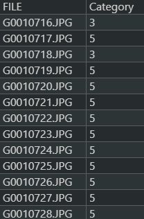
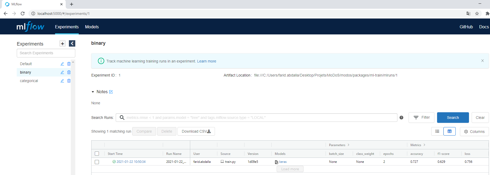
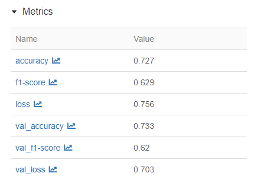
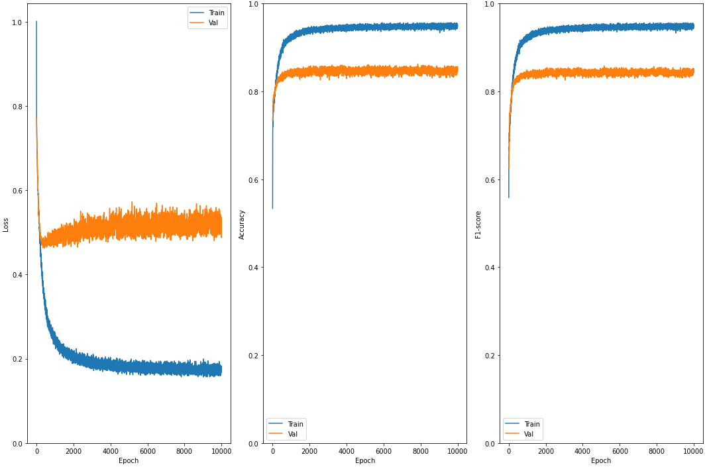
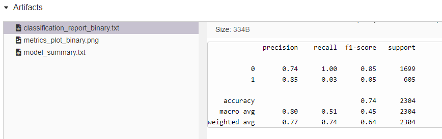

# MoDoS ML-Train

## Requirements

* [Python 3.7.9](https://www.python.org/downloads/release/python-379/)

## Setting up the environment
Inside the ml-deploy folder
### Create the venv
```bash
python3 -m venv venv
```
If you are using a system where python is the only python environment, you can use python instead of python3

### Activate the venv
#### Windows
```bash
.\venv\Scripts\activate
```
#### macOS and Linux
```bash
source venv/bin/activate
```
### Upgrade pip
```bash
python3 -m pip install --upgrade pip
```
### Install requirements
```bash
pip install -r requirements.txt
```

## Run


***
**Note**

In this doc you will come accross the term *binary* and *categorical*. 

*Binary*

Model that put images in two classes. Images with and without problem. In the definition of the project, images without problem are defined as the class 5. Images with problems are defined as class 1, 3, 4, 6, 7, 8, 9. In the binary dataset, class 5 will become class 0. The other classes will be defined as class 1. (see the folder hierarchy on [chapter Create the dataset](#create-the-dataset) for a better understanding)

*Categorical*

Model that classify the specific problem (class 1, 3, 4, 6, 7, 8, 9)

***


There are two scripts available in this package.

* create_dataset.py
* train.py

The first one is used to create the correct folder hierarchy necessary for the training dataset. The second is used to train and generate the models.

### Create the dataset

Before feeding the collected images to the model for training, some processing needs to be done. Originally, the pictures are in zip files and the labels corresponding to each pictures in a csv file. However, the model needs to have each pictures stored in a folder corresponding to its label.

The script *create_dataset.py* will take images from zip files and associate them with labels indicated in one or multiple csv files. Before running the script you might have this hierarchy:

```bash
|-- data
    |-- raw
        |-- images.zip
        |-- labels.csv
```

After running the script you will get this:

```bash
|-- data
    |-- binary
        |-- 0
        |-- 1
    |-- categorical
        |-- 1
        |-- 3
        |-- 4
        |-- 6
        |-- 7
        |-- 8
        |-- 9
    |-- raw
        |-- images.zip
        |-- labels.csv
```

#### Run the script

Let's have a look at the parameters of the script:

```bash
$ python create_dataset.py --help
Usage: create_dataset.py [OPTIONS]

Options:
  -i, --image_path PATH    Either a folder containing multiple zip files of
                           image or the path to a single zip file  [default:
                           ./data/raw]

  -l, --label_path PATH    Either a folder containing multiple csv of labels
                           or the path to a single csv  [default: ./data/raw]

  -f, --file_col TEXT      Name of the column holding the file names in the
                           csv file  [default: FILE]

  -c, --category_col TEXT  Name of the column holding the category name in the
                           csv file  [default: Category]

  --help                   Show this message and exit.
```

To be able to run the script with the default values, you have to put all images in a zip file located in the directory *./data/raw* (can be specified with the parameter *--image_path*).

In the same directory you have to put a csv file containing the labels (can be specified with the parameter *--label_path*).

The csv file needs at list two columns:

* A column named *FILE* (can be changed with the parameter *--file_col*) that holds the filename for every files in the zip files.
* A column named *Category* (can be changed with the parameter *--category_col*) that indicates the label of the file.

An example of correct hierarchy:

```
|-- data
    |-- raw
        |-- YverdonDataset.csv
        |-- YverdonDatasetpart1.zip
        |-- YverdonDatasetpart2.zip
        |-- YverdonDatasetpart3.zip
```

With the *YverdonDataset.csv* containing:



### Train the model

Here is the project structure:

```
|-- ml-train
    |-- configs							<-- Holds the configuration to train the models
        |-- binary_config.json
        |-- categorical_config.json
    |-- data                            <-- Input data to train the binary or categorical models
        |-- binary
        |-- categorical
    |-- mlruns							<-- Store models results
    |-- models
        |-- binary
        |-- categorical
    |-- src								<-- Source code for use in the project
    |-- train.py						<-- Script used to train the models
```

The file *train.py* uses the datasets stored in *data/binary* and *data/categorical* along with the configs *configs/binary_config.json* and *configs/categorical_config.json* to create the models and store them in *models/binary* and *models/categorical*. Models informations are stored with mlflow in the folder *mlruns*.

Let's have a look at the parameters in the file *configs/binary_config.json*:

```json
{
    "num_epochs": 10000,
    "learning_rate": 0.001,
    "batch_size": 256,
    "image_shape":160
}
```

* ***num_epochs***: The number of epochs to train the model. The bigger the number, the longer it will take to complete the training
* ***learning_rate***: Controls how much we are adjusting the weights with respect to the loss gradient. Should be a low number
* ***batch_size***: Number of pictures treated in each batch. A big number helps to have every class samples in every train batches.
* ***image_shape***: The input shape of the pictures. Shouldn't be changed.

#### Run the script

Let's see the available options to run the script:

```bash
$ python train.py --help
Usage: train.py [OPTIONS]

Options:
  --ignore [binary|categorical]  Ignore the training of either the binary or
                                 the categorical model

  --verbose                      Print execution informations
  --help                         Show this message and exit.
```

To train the binary model and the categorical model, just run the script without any options. If you want to train only the binary model or the categorical model, then you can ignore a model by specifying the parameter *--ignore binary* or *--ignore categorical*.

Here is an example when training on 2 epochs:

```bash
$ python train.py --verbose
Loading config file for binary
Loading dataset for binary
Found 9976 files belonging to 2 classes.
WARNING:tensorflow:There are non-GPU devices in `tf.distribute.Strategy`, not using nccl allreduce.
Training binary model
2021/01/28 10:09:45 INFO mlflow.utils.autologging_utils: keras autologging will track hyperparameters, performance metrics, model artifacts, and lineage information for the current keras workflow to the MLflow run with ID '272898f9d6ce493b9d52913e8d9cf1a1'
Epoch 1/2
21/21 [==============================] - 74s 3s/step - loss: 0.8342 - accuracy: 0.6537 - f1-score: 0.6189 - val_loss: 0.7492 - val_accuracy: 0.7218 - val_f1-score: 0.6052
Epoch 2/2
21/21 [==============================] - 44s 2s/step - loss: 0.7513 - accuracy: 0.7257 - f1-score: 0.6443 - val_loss: 0.7192 - val_accuracy: 0.7227 - val_f1-score: 0.6072
Theses are the results for the training
              precision    recall  f1-score   support

           0       0.72      1.00      0.84      1663
           1       1.00      0.00      0.01       641

    accuracy                           0.72      2304
   macro avg       0.86      0.50      0.42      2304
weighted avg       0.80      0.72      0.61      2304

Are you satisfied with this result? (Saying yes will train the model on the remaining data during (validation set) for half the number of epoch used to get these results) [y/N]: y
```

At the end of the training, the model score is displayed. You can see the score of individual classes (f1-score) and the global score of the model (weighted avg f1-score). If you are satisfied with the results you can type 'y' to train on the data used to evaluate the model. Half the number of epoch used to train will be used to generate the model.

At the end of the binary model training, the categorical model will be trained.

Note: If you do not want to type yes at the end of th training, you can run the script like this:

```bash
$ yes | python train.py
```

#### Consult the logs with ml-flow

To consult the logs, you have to start the mlflow server. To do so, in the directory containing the *mlruns* folder, run:

```bash
$ mlflow ui
```

or

```bash
$ mlflow ui --host 0.0.0.0
```

If the folder is on a remote server, to access it from your PC.

You can now access to the server adress / localhost on port 5000 with your browser.




On the left you can access to the logs for the binary or categorical model. When binary or categorical is selected, you can see every runs that have been logged. You can click on the *Start Time* of an experiment to consult the logs. What interest us are the different metrics:



The interesting one is the *val_f1-score*. It should be better than the previous model. 

Another interesting log is under *Artifacts*, the *metrics_plot_binary.png* or *metrics_plot_categorical.png*. You can see the evolution of the *Loss*, *Accuracy* and *f1-score* depending on the number of epochs. It might be useful to adjust the number of epochs on the following trains when more epochs does not improve the model.



Here for instance, we could reduce the number of epochs to 3000 and still have similar results.

It is also possible to consult the classification report by clicking on *classification_report_binary.txt* or *classification_report_categorical.txt* 



After training the model on the full dataset, you can find the saved model under *models/binary/{run_name}* or *models/categorical/{run_name}* where run_name is the name of the experiment in ml-flow. You can copy the folder and use them in the deployed app.

